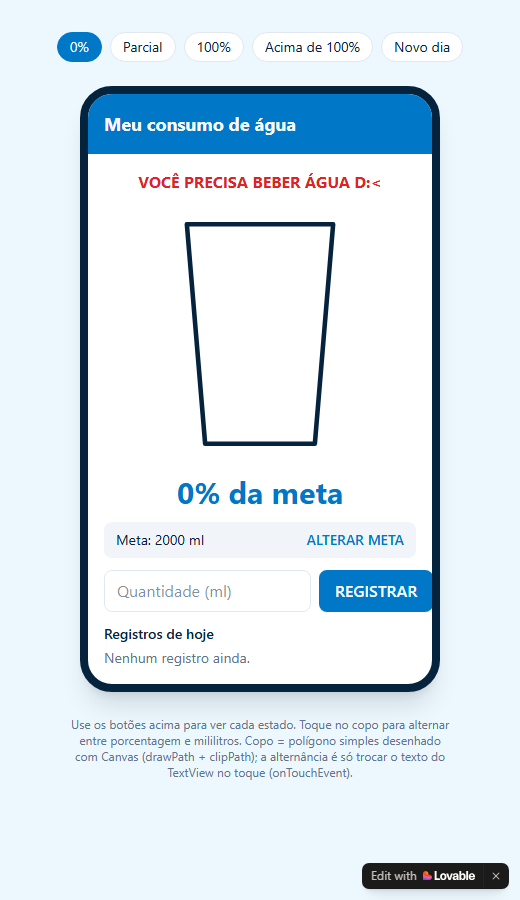
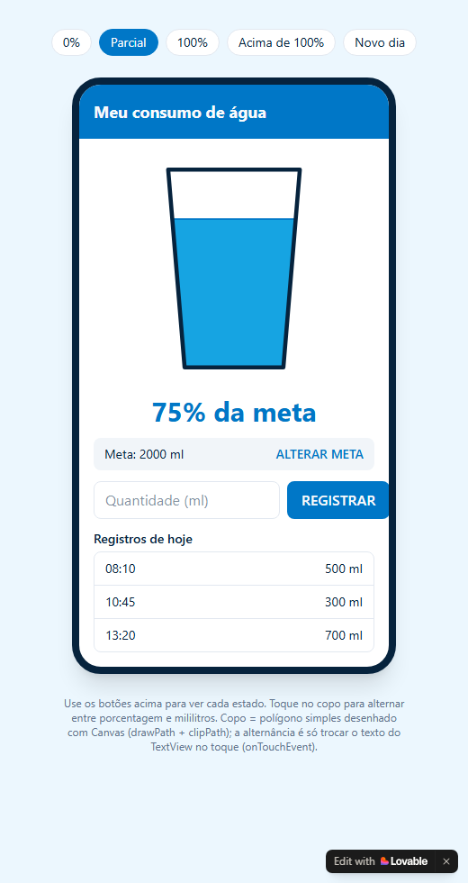
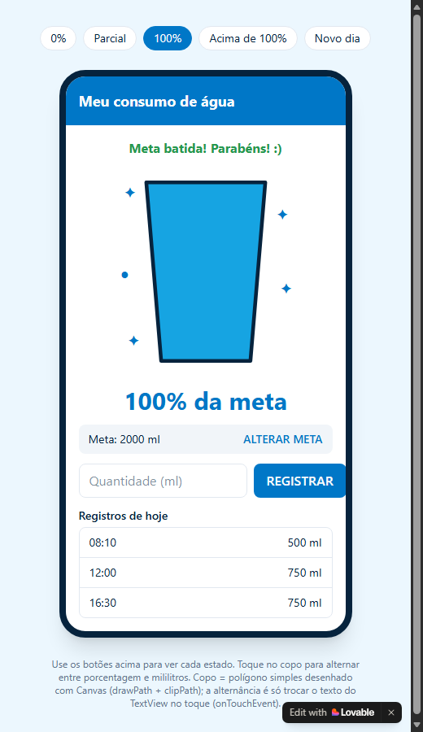
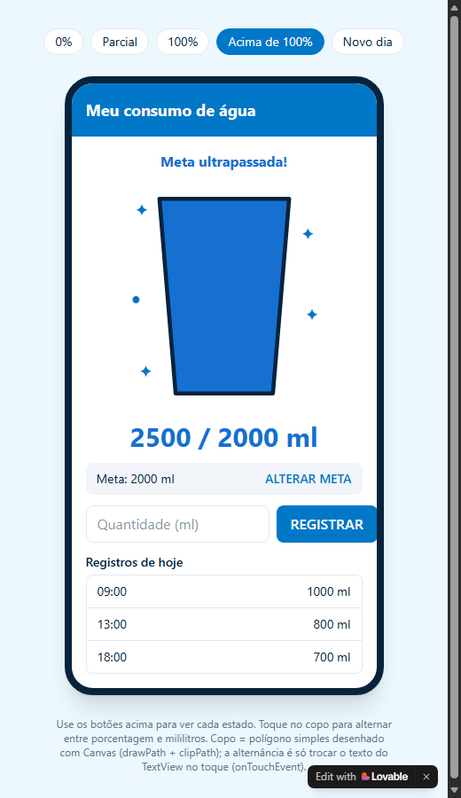

# Plano de Implementação — Avaliação 2

**Aplicativo "Meu consumo de água"** · Computação para Dispositivos Móveis
Alunas: Glenda Santana e Letícia Almeida · Entrega e apresentação: **15/10/2026**

---

## 1. Resumo do que precisa ser entregue

Um app Android em **Java** que:

1. Tem uma **View customizada `WaterProgressView`**, desenhada com `Canvas`, reutilizável, com atributos XML (`progressColor`, `textColor`, `maxValue`) lidos com `TypedArray`.
2. Deixa o usuário **definir/alterar a meta diária** (ml) e **registrar volumes** (ml) ao longo do dia.
3. Mostra o **consumo de cada registro**, o **acumulado** e o progresso no componente gráfico, com **animação suave** ao atualizar.
4. **Persiste** meta, registros (volume + horário) e acumulado, recuperando tudo ao reabrir o app.
5. Permite **passar de 100%** e mostra um **alerta visual** (no componente e na tela) enquanto acumulado > meta; o alerta some se a meta for alterada e a condição deixar de valer.
6. Ao **tocar no componente**, alterna entre modo **percentual** ("75%") e **absoluto** ("1500 / 2000 ml").
7. Considera o **dia**: registros de dias anteriores são descartados quando a data do sistema muda.
8. Será avaliado com **defesa oral do código** — então tudo que fizermos deve ser algo que a gente consiga explicar.

## 2. Ponto de partida

| Item | Situação |
|---|---|
| Projeto `projeto-dispositivos-moveis-master` | Esqueleto Android Studio com `MainActivity` vazia (só "Hello World"), Java 11, tema Material3 DayNight, `minSdk 33`, `targetSdk 37`. Sem nenhuma classe própria ainda. |
| Atividades de aula (`GUIBasico`) e slides 3 a 6 | **Não são considerados parte do trabalho pronto.** Tudo será construído do zero neste repositório; servem só como referência de estudo. |

> Do esqueleto aproveitamos apenas a configuração (Gradle, tema, `MainActivity` e `activity_main.xml` de exemplo, que serão reescritos). Nenhuma lógica do app existe ainda.

> Observação: o projeto está aninhado (`projeto-dispositivos-moveis-master/projeto-dispositivos-moveis-master`). O código vai dentro da pasta interna, que é a que tem o `build.gradle.kts`.

## 3. O protótipo (design a seguir)

Tela única, estilo Android com cabeçalho azul. Capturas do protótipo em cada estado:

| 0% | Parcial (75%) |
|---|---|
| {width=250} | {width=250} |

| 100% | Acima de 100% (modo ml) |
|---|---|
| {width=250} | {width=250} |

### 3.1 Elementos da tela (de cima para baixo)

1. **Cabeçalho** azul com o título "Meu consumo de água" (texto branco, negrito).
2. **Mensagem de status** (uma linha, negrito, centralizada), que depende do estado:
   - 0 ml registrados → vermelho: *"VOCÊ PRECISA BEBER ÁGUA D:<"*
   - acumulado == meta → verde: *"Meta batida! Parabéns! :)"*
   - acumulado > meta → azul escuro: *"Meta ultrapassada!"*
   - demais casos → mensagem oculta
3. **Copo (a `WaterProgressView`)**: trapézio com contorno azul-marinho grosso; a água sobe proporcionalmente ao percentual, com uma linha mais escura na superfície. Em ≥100% aparecem **brilhos (✦ ●)** ao redor. Acima de 100% o copo fica cheio e a água muda para um **azul mais escuro**.
4. **Texto grande abaixo do copo**: `75% da meta` ou `1500 / 2000 ml` (alterna ao tocar no copo). Fica azul escuro quando ultrapassa a meta.
5. **Faixa cinza-clara**: `Meta: 2000 ml` à esquerda e `ALTERAR META` à direita; ao tocar, vira campo numérico + `SALVAR`.
6. **Linha de registro**: campo `Quantidade (ml)` + botão azul `REGISTRAR`.
7. **"Registros de hoje"**: lista com horário à esquerda e volume à direita (`08:10 — 500 ml`); vazia mostra *"Nenhum registro ainda."*

### 3.2 Paleta (valores aproximados, tirados do CSS do protótipo — ajustar na tela)

| Uso | Cor aproximada | Nome em `colors.xml` |
|---|---|---|
| Cabeçalho, botões, textos de destaque | `#0077C8` | `primary` |
| Água | `#17A2E3` | `water` |
| Água acima da meta / texto acima da meta | `#1D6BCB` | `water_over` |
| Contorno do copo / texto principal | `#082642` | `foreground` |
| Alerta "beber água" | `#D92D20` | `alert` |
| Sucesso (meta batida) | `#2E9E4F` | `success` |
| Fundo da tela | `#EEF8FF` | `background` |
| Faixa da meta / bordas da lista | `#F1F5F9` / `#E2E8F0` | `secondary` / `border` |

### 3.3 Diferenças deliberadas entre o protótipo web e o app

- Os botões "0% / Parcial / 100% / Acima de 100% / Novo dia" no topo do protótipo são **só para demonstrar estados**. **Não entram no app**; o estado vem dos dados reais. O "Novo dia" é substituído pela **detecção automática pela data do sistema** (exigência da avaliação).
- A avaliação diz que o **texto com o percentual e o título fazem parte da `WaterProgressView`**. Então o título ("Consumo diário de água"), o copo e o texto `75% da meta` / `1500 / 2000 ml` são **desenhados dentro do componente** (no protótipo o texto está num `TextView` à parte).
- Adotamos a **mesma regra de "ultrapassou" do protótipo, mas sobre ml** (`acumulado > meta`), não sobre o percentual arredondado — assim 2001/2000 ml (que arredonda para 100%) já conta como ultrapassou.

## 4. Arquitetura proposta

Poucas classes, cada uma com uma responsabilidade (ideia de MVC: Model / View / Controller = Activity).

```
com.example.projeto_dispositivos_moveis
├── MainActivity.java              Controller: liga tela, componente e dados
├── model
│   ├── RegistroConsumo.java       Model: um registro (ml + instante em millis)
│   └── ConsumoStorage.java        Model: lê/grava no SharedPreferences, regras do dia
└── widget
    └── WaterProgressView.java     View customizada (a "biblioteca interna")

res/
├── layout/activity_main.xml
├── layout/item_registro.xml       (uma linha da lista: horário + volume)
├── values/attrs.xml               atributos do WaterProgressView
├── values/colors.xml, strings.xml, themes.xml
└── drawable/ (fundos arredondados dos campos/faixa, se necessário)
```

### 4.1 `WaterProgressView` — contrato público

| Membro | Descrição |
|---|---|
| Construtor `(Context, AttributeSet)` | Lê `progressColor`, `textColor`, `maxValue` (+ opcionais `overColor`, `title`) com `TypedArray` e `recycle()` no `finally`, com `obtainStyledAttributes(attrs, R.styleable.WaterProgressView, 0, 0)`. |
| `setMaxValue(int ml)` | Altera a meta em tempo de execução e reanima. |
| `setConsumo(int ml)` | Informa o acumulado; calcula `percentual = ml * 100 / maxValue` e chama `setProgress`. |
| `setProgress(int percentual)` | **Método exigido.** Aceita valores > 100 (sem limitar). Inicia o `ValueAnimator` do valor exibido atual até o novo e chama `invalidate()` a cada quadro. |
| `isAcimaDaMeta()` | `true` se acumulado > meta (usado também pela Activity). |
| `setModoAbsoluto(boolean)` / alternância no toque | `performClick()` inverte o modo; guardar o modo no próprio componente. |

**`onDraw` (ordem de desenho):**
1. Título "Consumo diário de água" no topo (`drawText`).
2. Copo: `Path` do trapézio → `canvas.save()` → `clipPath(copo)` → `drawRect` da água (altura = `min(percentual,100)%` do copo) → `restore()`.
3. Linha de superfície da água (se 0 < p < 100).
4. Contorno do copo (`Paint.Style.STROKE`, traço grosso).
5. Brilhos ✦ ● se `p >= 100`.
6. Texto central: `"75% da meta"` ou `"1500 / 2000 ml"`; cor muda para `water_over` se acima da meta, e aparece a legenda **"Meta ultrapassada!"**.

**Cuidados técnicos:**
- Criar os `Paint` e o `Path` **uma vez** (no construtor / `onSizeChanged`), não dentro do `onDraw` (criar o `Paint` dentro do `onDraw` funciona, mas aqui ele roda a cada quadro da animação).
- Calcular a geometria do copo em `onSizeChanged` com base em `getWidth()/getHeight()` (sem coordenadas fixas em pixels). Assim funciona com `200dp x 200dp` ou qualquer outro tamanho.
- Tratar `maxValue <= 0` (evitar divisão por zero).
- Valor exibido na animação é `float`; o texto mostra o inteiro arredondado.

### 4.2 Persistência — escolha e justificativa

**Escolha: `SharedPreferences`.**

> Justificativa (para o texto da entrega e a defesa oral): os dados são poucos (uma meta, uma data e uma lista curta de registros de um único dia), sem consultas complexas nem relacionamentos. `SharedPreferences` é o mecanismo simples de pares chave-valor, é simples, privado ao app e mantém os dados após fechar o app. SQLite/Room seriam excessivos para esse volume.

**Chaves (arquivo `"ConsumoAgua"`, `MODE_PRIVATE`):**

| Chave | Tipo | Conteúdo |
|---|---|---|
| `meta_ml` | int | Meta diária (padrão 2000) |
| `data_dia` | String | Dia dos registros no formato `yyyy-MM-dd` |
| `registros` | String | Lista serializada: `instanteMillis:ml;instanteMillis:ml;...` |
| `acumulado_ml` | int | Soma dos registros do dia (exigido pela avaliação) |

- A lista vira String com `split(";")`/`split(":")` — só `String`, `Long.parseLong`, `Integer.parseInt`; sem biblioteca nova.
- O **acumulado também é gravado** (a avaliação pede), mas ao carregar **confere-se** com a soma dos registros e a soma prevalece, evitando inconsistência.
- Gravar com `apply()` **a cada ação** (registrar, alterar meta) — não só no `onPause`, para não perder dados se o app for encerrado.

**Regra do novo dia (`ConsumoStorage.verificarNovoDia()`):**
1. Pegar a data de hoje (`yyyy-MM-dd`).
2. Se `data_dia` ≠ hoje → apagar `registros`, zerar `acumulado_ml`, gravar `data_dia = hoje`. **A meta é mantida.**
3. Chamar isso no `onCreate` **e no `onResume`** (cobre o caso de o app ficar aberto/em segundo plano passando da meia-noite).

### 4.3 Alerta de ultrapassagem — como garantir que é "real"

- Uma única fonte da verdade: `ConsumoStorage` (meta + acumulado).
- Um único método na `MainActivity`, `atualizarTela()`, que **sempre** relê os valores do storage e atualiza **tudo**: componente, mensagem de status, lista, texto da meta. É chamado ao abrir, após registrar, após alterar a meta e no `onResume`.
- `acimaDaMeta = acumulado > meta` calculado ali, nunca guardado como flag solta. Alterar a meta para um valor maior → `atualizarTela()` recalcula → alerta some automaticamente.
- Consistência: mensagem "Meta ultrapassada!" na tela **e** cor/legenda no componente, ambos vindos do mesmo cálculo.

## 5. Plano passo a passo (tudo do zero)

O trabalho está dividido em **7 etapas**. Cada uma tem uma **entrega concreta**: algo que dá para abrir no emulador e ver funcionando (ou, na etapa de dados, algo que dá para provar com um teste). Só passamos para a próxima quando a anterior estiver "pronta quando…".

### Visão geral: o que sai de cada etapa

| Etapa | O que fica pronto | O que dá para ver / provar | Tempo |
|---|---|---|---|
| 1. Base do projeto | Projeto limpo, cores, textos e tema do protótipo | App abre com fundo azul-claro e cabeçalho azul "Meu consumo de água" | ≈ 2,5 h |
| 2. Copo desenhado | `WaterProgressView` desenhando título, copo, água e texto | Um copo 75% cheio com "75% da meta"; mudar o XML muda cor, meta e tamanho | ≈ 4 h |
| 3. Copo "vivo" | Animação, alerta de ultrapassagem e alternância ao toque | Botões provisórios +500/−500 ml: a água sobe e desce suave; passa de 100% e fica azul-escuro; tocar alterna % ↔ ml | ≈ 4 h |
| 4. Dados que sobrevivem | Classes de modelo e armazenamento (meta, registros, acumulado, novo dia) | Gravar registros, fechar o app, reabrir: os valores voltam; trocar a data limpa os registros | ≈ 3,5 h |
| 5. Tela final (visual) | Layout completo igual ao protótipo, com dados de exemplo | Tela idêntica às capturas, mas ainda sem funcionar | ≈ 4 h |
| 6. Tudo ligado | `MainActivity` conectando tela, componente e dados | **App completo funcionando**: registrar, alterar meta, alerta, persistência | ≈ 4 h |
| 7. Acabamento e defesa | Código comentado, README e ensaio | App sem erros, README com a justificativa da persistência, dupla pronta para explicar tudo | ≈ 5 h |

> As etapas 2–3 (componente) e 4 (dados) não dependem uma da outra e podem ser feitas em paralelo. A etapa 5 só precisa da 2. A etapa 6 junta tudo.

---

### Etapa 1 — Base do projeto

**Entrega:** o esqueleto limpo, com a identidade visual do protótipo.

**O que você vai ver no celular:** tela com fundo azul-claro e uma faixa azul no topo com o texto "Meu consumo de água" em branco. Nada mais.

**Arquivos criados ou alterados**
- `res/values/colors.xml` — paleta da seção 3.2.
- `res/values/strings.xml` — todos os textos do app (título, botões, hints, mensagens de status e de erro, "Registros de hoje"…).
- `res/values/themes.xml` e `values-night/themes.xml` — tema claro (`Theme.Material3.Light.NoActionBar`).
- `res/layout/activity_main.xml` — remove o "Hello World!" e deixa só o cabeçalho.
- `MainActivity.java` — passa a tratar as bordas do sistema (`EdgeToEdge.enable` + *insets*), porque com `targetSdk 37` o app desenha sob a barra de status.
- Pastas (pacotes) `model` e `widget`, vazias por enquanto.

**Pronto quando**
- o app compila e abre no emulador/celular (Android 13+);
- o cabeçalho não fica escondido atrás da barra de status;
- não há nenhum texto escrito direto nos layouts (tudo em `strings.xml`).

---

### Etapa 2 — Copo desenhado (`WaterProgressView` estática)

**Entrega:** a View customizada desenhando tudo na tela, ainda sem animação nem dados reais.

**O que você vai ver no celular:** o título "Consumo diário de água", um copo trapezoidal com contorno azul-marinho, água azul preenchendo 75% da altura, e o texto "75% da meta" abaixo. Se mudarmos `app:maxValue`, `app:progressColor`, `app:textColor` ou o tamanho (`200dp`, `150dp`…) no XML, o desenho muda de acordo.

```
 Consumo diário de água
        ┌──────────┐
        │          │
        │▒▒▒▒▒▒▒▒▒▒│   <- água (75%)
        │▒▒▒▒▒▒▒▒▒▒│
         └────────┘
        75% da meta
```

**Arquivos criados ou alterados**
- `widget/WaterProgressView.java` (novo) — classe que estende `View`, lê os atributos do XML (`TypedArray`), calcula a geometria em `onSizeChanged` e desenha em `onDraw`: título → copo recortado com `clipPath` e preenchido com a água → contorno → texto.
- `res/values/attrs.xml` (novo) — `progressColor`, `textColor`, `maxValue` (+ `overColor` e `title` opcionais).
- Um layout provisório de teste usando o componente com `200dp x 200dp`.

**Pronto quando**
- o componente aparece com `wrap_content` e com tamanhos fixos, sem cortar o desenho;
- valores fixos de 0%, 50%, 100% e 150% desenham corretamente o nível da água (acima de 100% o copo fica cheio, sem a água "vazar" para fora);
- os atributos do XML realmente alteram cores e meta.

---

### Etapa 3 — Copo "vivo": animação, alerta e toque

**Entrega:** o comportamento completo do componente, ainda controlado por botões provisórios.

**O que você vai ver no celular:** a tela de teste tem dois botões "+500 ml" e "−500 ml". Ao apertar, a água **sobe ou desce suavemente** (cerca de meio segundo) e o texto muda. Ao passar de 100%, o copo fica cheio, a água muda para azul-escuro, aparecem brilhos ao redor e a legenda **"Meta ultrapassada!"**. Ao tocar no copo, o texto alterna entre `125% da meta` e `2500 / 2000 ml`, mantendo o valor.

**Arquivos alterados**
- `widget/WaterProgressView.java` — ganha a API pública: `setMaxValue(int ml)`, `setConsumo(int ml)`, **`setProgress(int percentual)`** (exigido pela avaliação, aceita valores acima de 100), animação com `ValueAnimator` + `invalidate()`, regra "acima da meta" (`consumo > meta`, em ml), brilhos e legenda, alternância de modo no clique.
- Layout provisório de teste com os botões "+500/−500".

**Pronto quando**
- a transição é animada, sem "pulos", mesmo com cliques rápidos seguidos;
- 100% exato mostra brilhos mas **sem** alerta; 2001/2000 ml já mostra o alerta;
- diminuir o consumo (ou aumentar a meta) faz o alerta desaparecer;
- a alternância funciona abaixo, em e acima de 100%.

---

### Etapa 4 — Dados que sobrevivem (persistência)

**Entrega:** as classes que guardam e recuperam tudo, incluindo a regra do dia.

**O que dá para provar:** uma tela provisória (ou testes JUnit) que grava meta e alguns registros, **fecha o app e, ao reabrir, mostra os mesmos valores**. Ao mudar a data do sistema para o dia seguinte, os registros somem e a meta continua.

**Arquivos criados**
- `model/RegistroConsumo.java` — um registro: volume em ml e instante (horário em milissegundos).
- `model/ConsumoStorage.java` — usa `SharedPreferences` (arquivo `"ConsumoAgua"`) com as chaves `meta_ml`, `data_dia`, `registros` e `acumulado_ml` (seção 4.2). Métodos: ler/gravar meta, adicionar registro, listar registros, calcular acumulado e `verificarNovoDia()`.

**Pronto quando**
- meta, registros (volume + horário) e acumulado voltam idênticos após fechar e reabrir;
- registros de um dia anterior são descartados e a meta é mantida;
- dados vazios ou corrompidos não derrubam o app (retorna lista vazia).

---

### Etapa 5 — Tela final (somente visual)

**Entrega:** o layout completo, igual ao protótipo, preenchido com dados de exemplo.

**O que você vai ver no celular:** a tela das capturas da seção 3, de cima para baixo: cabeçalho azul → mensagem de status → `WaterProgressView` → faixa cinza "Meta: 2000 ml · ALTERAR META" → campo "Quantidade (ml)" + botão REGISTRAR → "Registros de hoje" com linhas como `08:10 — 500 ml`. Os botões ainda não fazem nada.

```
┌─────────────────────────────┐
│ Meu consumo de água         │  <- cabeçalho azul
├─────────────────────────────┤
│   Meta ultrapassada!        │  <- status
│        (copo)               │
│   2500 / 2000 ml            │
│ Meta: 2000 ml  ALTERAR META │
│ [Quantidade (ml)] REGISTRAR │
│ Registros de hoje           │
│ 09:00               1000 ml │
│ 13:00                800 ml │
└─────────────────────────────┘
```

**Arquivos criados ou alterados**
- `res/layout/activity_main.xml` — tela completa com `ConstraintLayout` na raiz (cada item preso ao anterior e às bordas); a lista de registros fica dentro de um `ScrollView`.
- `res/layout/item_registro.xml` — uma linha da lista (horário à esquerda, volume à direita).
- `res/drawable/*.xml` — fundos arredondados dos campos e da faixa da meta.

**Pronto quando**
- a tela é visualmente parecida com as quatro capturas do protótipo;
- não há textos cortados nem barras de rolagem horizontais;
- a faixa da meta tem os dois estados prontos (leitura e edição), alternáveis por visibilidade.

---

### Etapa 6 — Tudo ligado (app funcionando)

**Entrega:** o aplicativo completo, cumprindo todos os requisitos da avaliação.

**O que você vai ver no celular:** digitar um volume e tocar em REGISTRAR faz a água subir, a linha aparecer na lista com o horário atual e o acumulado atualizar. Passar da meta acende o alerta na mensagem de status e no copo. Alterar a meta preserva os registros e recalcula tudo (o alerta some se deixar de valer). Fechar e reabrir mantém tudo.

**Arquivos alterados**
- `MainActivity.java` — liga as views, o componente e o `ConsumoStorage`. Um único método **`atualizarTela()`** relê os dados salvos e atualiza componente, mensagem de status, texto da meta e lista; é chamado ao abrir, ao registrar, ao alterar a meta e no `onResume` (junto com `verificarNovoDia()`).
- Validações com `Toast`: volume vazio, zero, não numérico ou absurdo (> 5000 ml); meta inválida (≤ 0 ou > 20000).
- Remoção da tela e dos botões provisórios das etapas anteriores.

**Pronto quando**
- todos os 12 cenários do roteiro da seção 6 passam;
- o app não fecha com nenhuma entrada inválida.

---

### Etapa 7 — Acabamento e defesa oral

**Entrega:** um código que dá para explicar e um repositório pronto para entregar.

**O que fica pronto**
- comentários pertinentes nas partes difíceis (`onDraw`, `clipPath`, animação, regra de novo dia) e nomes claros e consistentes;
- giro de tela testado (sem erro, dados preservados);
- `README.md` com descrição do app, como executar e a **justificativa da escolha de persistência** (exigida no enunciado);
- ensaio da defesa, com as duas explicando qualquer parte do código.

**Perguntas prováveis na defesa**
- Por que estender `View` e não compor XML? O que são `onDraw`, `Canvas` e `Paint`?
- Para que servem `attrs.xml`, `TypedArray` e `recycle()`?
- Como o `setProgress` redesenha? O que faz o `invalidate()`? Como funciona a animação?
- Por que `clipPath`? Como valores acima de 100% são tratados?
- Por que `SharedPreferences`? Como a lista é gravada? Como o novo dia é detectado e o que é mantido?
- Como o alerta desliga ao alterar a meta? O que acontece com entradas inválidas?

**Pronto quando:** cada uma consegue explicar, sem consultar, o fluxo "registrar → gravar → atualizar tela → redesenhar o copo".

## 6. Roteiro de testes (checklist final)

| # | Cenário | Resultado esperado |
|---|---|---|
| 1 | Primeira abertura | Meta 2000, 0%, copo vazio, mensagem vermelha "VOCÊ PRECISA BEBER ÁGUA D:<", "Nenhum registro ainda." |
| 2 | Registrar 500 ml | 25%, lista com horário atual e 500 ml, animação suave |
| 3 | Registrar até 2000 ml exatos | 100%, brilhos, mensagem verde "Meta batida!", sem alerta de ultrapassagem |
| 4 | Registrar +500 ml (2500) | 125%, copo cheio azul escuro, "Meta ultrapassada!" na tela **e** no componente |
| 5 | Tocar no copo | Alterna `125% da meta` ↔ `2500 / 2000 ml`; funciona também acima da meta |
| 6 | Alterar meta para 3000 | Registros mantidos, ~83%, **alerta some** |
| 7 | Alterar meta para 1000 | Alerta volta (250%) |
| 8 | Fechar totalmente o app e reabrir | Meta, registros e acumulado idênticos |
| 9 | Mudar a data do sistema para o dia seguinte e reabrir (ou voltar ao app) | Registros apagados, 0%, meta mantida |
| 10 | Entradas inválidas (vazio, 0, negativo, texto, número enorme) | `Toast` de erro, nada gravado, app não fecha |
| 11 | Componente em outro layout com 150dp e cor diferente | Renderiza proporcional, sem cortar |
| 12 | Girar a tela | Sem crash; dados preservados |

## 7. Cronograma sugerido (hoje: 08/10 → entrega: 15/10)

| Dia | Atividade |
|---|---|
| Qui 08/10 | Etapa 1 (base do projeto) |
| Sex 09/10 | Etapa 2 (copo desenhado) |
| Sáb 10/10 | Etapa 3 (copo "vivo") |
| Dom 11/10 | Etapa 4 (dados que sobrevivem) |
| Seg 12/10 | Etapa 5 (tela final) |
| Ter 13/10 | Etapa 6 (tudo ligado) e testes |
| Qua 14/10 | Etapa 7 (acabamento, README, ensaio): dia de folga para imprevistos |
| Qui 15/10 | **Entrega e defesa** |

Divisão sugerida: uma pessoa nas Etapas 2–3 (componente) e a outra nas Etapas 4–5 (dados e layout); a Etapa 6 em dupla, já que é onde as partes se encontram.
